# 04_DATABASE_ERD.md
# Entity Relationship Document
## Tanzanian Payroll & HR Management System

---

| Attribute  | Value                                                                             |
|------------|-----------------------------------------------------------------------------------|
| Version    | 1.0                                                                               |
| Status     | Draft                                                                             |
| Derived From | `03_DATABASE_SPECIFICATION.md` (sole source of truth)                          |
| Feeds Into | `05_SYSTEM_ARCHITECTURE.md`, Migration files, Model definitions                  |
| Owner      | Database Architect                                                                |
| Audience   | Software Engineers, QA Engineers, AI Coding Agents                               |

> **Strict Derivation Rule:** Every table, column, relationship, and constraint in this document is derived exclusively from `03_DATABASE_SPECIFICATION.md`. Nothing has been invented or inferred. Any future change to the schema must be reflected in the spec first, then propagated here.

---

## Table of Contents

1. Entity Summary Table
2. Relationship Definitions
3. Mermaid ERD Diagram
4. Domain Grouping Map
5. Traceability Matrix

---

## 1. Entity Summary Table

This table lists every entity in the system, its classification, and its domain group.

| # | Table Name                    | Classification                              | Domain Group                  |
|---|-------------------------------|---------------------------------------------|-------------------------------|
| 1 | `users`                       | Operational (Soft Delete)                   | Identity & Access Control     |
| 2 | `user_roles`                  | **SUPERSEDED** (Spatie Permission)          | Identity & Access Control     |
| 3 | `user_department_scopes`      | Operational (Soft Delete)                   | Identity & Access Control     |
| 4 | `password_reset_tokens`       | Operational                                 | Identity & Access Control     |
| 5 | `company_profile`             | Operational                                 | Organizational Structure      |
| 6 | `system_settings`             | Operational                                 | Organizational Structure      |
| 7 | `branches`                    | Operational (Soft Delete)                   | Organizational Structure      |
| 8 | `departments`                 | Operational (Soft Delete)                   | Organizational Structure      |
| 9 | `cost_centers`                | Operational (Soft Delete)                   | Organizational Structure      |
| 10 | `banks`                      | Operational                                 | Employee Lifecycle            |
| 11 | `employees`                  | Operational (Soft Delete)                   | Employee Lifecycle            |
| 12 | `employee_bank_details`      | Operational (Soft Delete)                   | Employee Lifecycle            |
| 13 | `employee_scheme_enrollments`| Hard Record (Effective-Dated)               | Employee Lifecycle            |
| 14 | `emergency_contacts`         | Operational                                 | Employee Lifecycle            |
| 15 | `employee_documents`         | Operational (Soft Delete)                   | Employee Lifecycle            |
| 16 | `salary_structures`          | Operational (Soft Delete)                   | Salary Structure & History    |
| 17 | `salary_histories`           | Hard Record (Append-Only)                   | Salary Structure & History    |
| 18 | `earning_types`              | Operational (Soft Delete)                   | Earnings Configuration        |
| 19 | `employee_earnings`          | Operational                                 | Earnings Configuration        |
| 20 | `deduction_types`            | Operational (Soft Delete)                   | Deductions Configuration      |
| 21 | `employee_deductions`        | Operational                                 | Deductions Configuration      |
| 22 | `statutory_configurations`   | Hard Record (Effective-Dated)               | Statutory Rate Configuration  |
| 23 | `paye_brackets`              | Hard Record (Effective-Dated)               | Statutory Rate Configuration  |
| 24 | `public_holidays`            | Operational                                 | Leave & Attendance            |
| 25 | `leave_records`              | Operational (Soft Delete)                   | Leave & Attendance            |
| 26 | `overtime_records`           | Operational (Soft Delete)                   | Leave & Attendance            |
| 27 | `loans`                      | Operational (Soft Delete)                   | Loan Management               |
| 28 | `loan_installments`          | Hard Record (Immutable after payroll lock)  | Loan Management               |
| 29 | `payroll_periods`            | Operational                                 | Payroll Period Governance     |
| 30 | `payroll_runs`               | Hard Record                                 | Payroll Engine                |
| 31 | `payroll_run_employee_scope` | Hard Record                                 | Payroll Engine                |
| 32 | `payroll_preflight_results`  | Hard Record                                 | Payroll Engine                |
| 33 | `payroll_run_results`        | Operational → Hard Record (on Lock)         | Payroll Engine                |
| 34 | `payslip_line_items`         | Hard Record                                 | Payroll Engine                |
| 35 | `payroll_arrears_workings`   | Hard Record                                 | Payroll Engine                |
| 36 | `payroll_run_state_logs`     | Hard Record (Append-Only)                   | Payroll Engine                |
| 37 | `bank_exports`               | Hard Record                                 | Bank Export Tracking          |
| 38 | `audit_logs`                 | Hard Record (Append-Only)                   | System & Audit                |
| 39 | `notifications`              | Operational (Soft Delete)                   | System & Audit                |

**Total: 39 entities cataloged (38 migrated + 1 superseded — `user_roles` is not created; roles are managed by `spatie/laravel-permission`. See `05_SYSTEM_ARCHITECTURE.md` §3.3.)**

---

## 2. Relationship Definitions

All `ON DELETE` behaviors comply with Section 7.3 of `03_DATABASE_SPECIFICATION.md`. `ON DELETE CASCADE` is strictly prohibited for financial, snapshot, and audit tables.

### 2.1 Identity & Access Control

| Parent Table | Child Table               | Type         | FK Column on Child     | ON DELETE    | Notes                                          |
|--------------|---------------------------|--------------|------------------------|--------------|------------------------------------------------|
| `users`      | `user_roles`              | **SUPERSEDED** | `user_id`              | N/A          | Roles managed by `spatie/laravel-permission`.  |
| `users`      | `user_department_scopes`  | One-to-Many  | `user_id`              | RESTRICT     | Scoped to `department_manager` role.           |
| `departments`| `user_department_scopes`  | One-to-Many  | `department_id`        | RESTRICT     | Scope assignment must be audited on deletion.  |

### 2.2 Organizational Structure

| Parent Table | Child Table    | Type        | FK Column on Child | ON DELETE | Notes                                             |
|--------------|----------------|-------------|---------------------|-----------|---------------------------------------------------|
| `branches`   | `departments`  | One-to-Many | `branch_id`         | RESTRICT  | NOT NULL. Every department must belong to a branch.|
| `branches`   | `cost_centers` | One-to-Many | `branch_id`         | RESTRICT  | Nullable. At least one of branch_id / department_id must be set.|
| `departments`| `cost_centers` | One-to-Many | `department_id`     | RESTRICT  | Nullable. At least one of branch_id / department_id must be set.|
| `users`      | `system_settings` | One-to-Many | `updated_by_user_id` | RESTRICT | Tracks who last updated each key-value setting.  |

### 2.3 Employee Lifecycle

| Parent Table    | Child Table                    | Type        | FK Column on Child    | ON DELETE | Notes                                                        |
|-----------------|--------------------------------|-------------|------------------------|-----------|--------------------------------------------------------------|
| `departments`   | `employees`                    | One-to-Many | `department_id`        | RESTRICT  | NOT NULL. Employee must belong to a department.             |
| `branches`      | `employees`                    | One-to-Many | `branch_id`            | RESTRICT  | NOT NULL. Employee must belong to a branch.                 |
| `employees`     | `employee_bank_details`        | One-to-Many | `employee_id`          | RESTRICT  | Multiple accounts allowed; primary identified by `is_primary = TRUE`.|
| `banks`         | `employee_bank_details`        | One-to-Many | `bank_id`              | RESTRICT  | NOT NULL. Account must reference a known bank.              |
| `employees`     | `employee_scheme_enrollments`  | One-to-Many | `employee_id`          | RESTRICT  | Hard Record. Uniqueness: `(employee_id, scheme_code, membership_number)` where `deleted_at IS NULL`.|
| `employees`     | `emergency_contacts`           | One-to-Many | `employee_id`          | RESTRICT  | At least one required.                                      |
| `employees`     | `employee_documents`           | One-to-Many | `employee_id`          | RESTRICT  | Soft deleted. `file_hash` required for compliance.          |
| `users`         | `employee_documents`           | One-to-Many | `uploaded_by_user_id`  | RESTRICT  | Tracks who uploaded the document.                           |

### 2.4 Salary Structure & History

| Parent Table        | Child Table         | Type        | FK Column on Child    | ON DELETE | Notes                                              |
|---------------------|---------------------|-------------|------------------------|-----------|---------------------------------------------------|
| `employees`         | `salary_histories`  | One-to-Many | `employee_id`          | RESTRICT  | Append-only. Active salary resolved by `effective_from`.|
| `salary_structures` | `salary_histories`  | One-to-Many | `salary_structure_id`  | RESTRICT  | Nullable. An employee's salary may not reference a grade.|

### 2.5 Earnings & Deductions Configuration

| Parent Table     | Child Table           | Type        | FK Column on Child     | ON DELETE | Notes                                                      |
|------------------|-----------------------|-------------|-------------------------|-----------|------------------------------------------------------------|
| `employees`      | `employee_earnings`   | One-to-Many | `employee_id`           | RESTRICT  | Recurring or one-time.                                     |
| `earning_types`  | `employee_earnings`   | One-to-Many | `earning_type_id`       | RESTRICT  | NOT NULL. Cannot orphan a payslip earning.                 |
| `payroll_periods`| `employee_earnings`   | One-to-Many | `payroll_period_id`     | RESTRICT  | Nullable. Required if `recurrence = one_time`.             |
| `employees`      | `employee_deductions` | One-to-Many | `employee_id`           | RESTRICT  | Recurring or one-time.                                     |
| `deduction_types`| `employee_deductions` | One-to-Many | `deduction_type_id`     | RESTRICT  | NOT NULL.                                                  |
| `payroll_periods`| `employee_deductions` | One-to-Many | `payroll_period_id`     | RESTRICT  | Nullable. Required if one-time deduction.                  |

### 2.6 Leave & Attendance

| Parent Table     | Child Table       | Type        | FK Column on Child   | ON DELETE | Notes                                                 |
|------------------|-------------------|-------------|----------------------|-----------|-------------------------------------------------------|
| `employees`      | `leave_records`   | One-to-Many | `employee_id`        | RESTRICT  | HR records leave directly; no approval workflow in MVP.|
| `employees`      | `overtime_records`| One-to-Many | `employee_id`        | RESTRICT  | Soft deleted.                                         |
| `payroll_periods`| `overtime_records`| One-to-Many | `payroll_period_id`  | RESTRICT  | NOT NULL. Overtime is tied to a specific payroll period.|
| `users`          | `overtime_records`| One-to-Many | `approved_by_user_id`| RESTRICT  | Nullable. Records who approved the overtime.          |

### 2.7 Loan Management

| Parent Table     | Child Table          | Type        | FK Column on Child  | ON DELETE | Notes                                                         |
|------------------|----------------------|-------------|---------------------|-----------|---------------------------------------------------------------|
| `employees`      | `loans`              | One-to-Many | `employee_id`       | RESTRICT  | Termination warning required if outstanding balance > 0.      |
| `loans`          | `loan_installments`  | One-to-Many | `loan_id`           | RESTRICT  | Installments are never deleted; balances restored on reversal.|
| `payroll_periods`| `loan_installments`  | One-to-Many | `payroll_period_id` | RESTRICT  | NOT NULL. Installment belongs to a specific period.           |

### 2.8 Payroll Engine

| Parent Table            | Child Table                    | Type        | FK Column on Child          | ON DELETE | Notes                                                             |
|-------------------------|--------------------------------|-------------|------------------------------|-----------|-------------------------------------------------------------------|
| `payroll_periods`       | `payroll_runs`                 | One-to-Many | `payroll_period_id`          | RESTRICT  | A period may have multiple runs (standard, supplementary, amended).|
| `payroll_runs`          | `payroll_runs`                 | Self-join   | `original_run_id`            | RESTRICT  | Nullable. Links amended run to its original filed run.           |
| `payroll_runs`          | `payroll_runs`                 | Self-join   | `reversed_by_run_id`         | RESTRICT  | Nullable. Links original run to the run that reversed it.        |
| `users`                 | `payroll_runs`                 | One-to-Many | `submitted_by_user_id`       | RESTRICT  | Maker identity. NOT NULL once submitted.                         |
| `users`                 | `payroll_runs`                 | One-to-Many | `approved_by_user_id`        | RESTRICT  | Checker identity. Nullable until approved.                       |
| `payroll_runs`          | `payroll_run_employee_scope`   | One-to-Many | `payroll_run_id`             | RESTRICT  | Hard Record. Defines employee inclusion per run.                 |
| `employees`             | `payroll_run_employee_scope`   | One-to-Many | `employee_id`                | RESTRICT  | Hard Record. Employee snapshot at run time.                      |
| `payroll_runs`          | `payroll_preflight_results`    | One-to-Many | `payroll_run_id`             | RESTRICT  | Hard Record. All validation warnings/errors logged.              |
| `employees`             | `payroll_preflight_results`    | One-to-Many | `employee_id`                | RESTRICT  | Nullable. Some errors are run-level, not employee-level.         |
| `payroll_runs`          | `payroll_run_results`          | One-to-Many | `payroll_run_id`             | RESTRICT  | One result per employee per run. Rewrites allowed in Draft/Preview; immutable after Lock.|
| `employees`             | `payroll_run_results`          | One-to-Many | `employee_id`                | RESTRICT  | NOT NULL.                                                        |
| `payroll_run_results`   | `payslip_line_items`           | One-to-Many | `payroll_run_result_id`      | RESTRICT  | Hard Record. Denormalized snapshot; no FK to earning_types.      |
| `payroll_run_results`   | `payroll_arrears_workings`     | One-to-Many | `payroll_run_result_id`      | RESTRICT  | Hard Record. Per-period arrears calculation detail.              |
| `payroll_periods`       | `payroll_arrears_workings`     | One-to-Many | `source_period_id`           | RESTRICT  | FK to `payroll_periods.id`. The historical period being corrected.|
| `earning_types`         | `payroll_arrears_workings`     | One-to-Many | `earning_type_id`            | RESTRICT  | Identifies which earning type triggered the arrears.             |
| `payroll_runs`          | `payroll_run_state_logs`       | One-to-Many | `payroll_run_id`             | RESTRICT  | Append-only. All state transitions logged.                       |
| `users`                 | `payroll_run_state_logs`       | One-to-Many | `actioned_by_user_id`        | RESTRICT  | NOT NULL. Records who triggered each transition.                 |

### 2.9 Bank Export & System

| Parent Table   | Child Table       | Type        | FK Column on Child      | ON DELETE | Notes                                                    |
|----------------|-------------------|-------------|--------------------------|-----------|----------------------------------------------------------|
| `payroll_runs` | `bank_exports`    | One-to-Many | `payroll_run_id`         | RESTRICT  | Hard Record. Many export attempts may be logged per run. |
| `users`        | `bank_exports`    | One-to-Many | `generated_by_user_id`   | RESTRICT  | NOT NULL.                                                |
| `users`        | `audit_logs`      | One-to-Many | `user_id`                | RESTRICT  | Append-only. Must not be deleted.                        |
| `users`        | `notifications`   | One-to-Many | `user_id`                | RESTRICT  | Email-only for MVP.                                      |

---

## 3. Mermaid ERD Diagram

> **Rendering note:** This diagram uses Mermaid `erDiagram` syntax. Paste into any Mermaid-compatible renderer (e.g., mermaid.live, GitHub Markdown preview). Relationship lines show cardinality. Only the primary FK linkages are drawn for readability; the full FK list is in Section 2.

```mermaid
erDiagram

    %% ─────────────────────────────────────────────
    %% DOMAIN: Identity & Access Control
    %% ─────────────────────────────────────────────
    users {
        bigint id PK
        string email UK
        string password_hash
        timestamp deleted_at
        timestamp created_at
        timestamp updated_at
    }
    %% user_roles entity is superseded by spatie/laravel-permission package
    user_department_scopes {
        bigint id PK
        bigint user_id FK
        bigint department_id FK
        timestamp deleted_at
    }
    password_reset_tokens {
        bigint id PK
        string email
        string token
        timestamp expires_at
    }

    %% users ||--o{ user_roles : "has roles" (superseded by package)
    users ||--o{ user_department_scopes : "scoped to"
    users ||--o{ password_reset_tokens : "has tokens"

    %% ─────────────────────────────────────────────
    %% DOMAIN: Organizational Structure
    %% ─────────────────────────────────────────────
    branches {
        bigint id PK
        string code UK
        string name
        timestamp deleted_at
    }
    departments {
        bigint id PK
        bigint branch_id FK
        string code UK
        string name
        timestamp deleted_at
    }
    cost_centers {
        bigint id PK
        bigint branch_id FK
        bigint department_id FK
        string code UK
        string name
        timestamp deleted_at
    }
    company_profile {
        bigint id PK
        string name
        string tin
        string address
        string registration_number
        int working_days_per_month
        int financial_year_start_month
        boolean sdl_enabled
        boolean wcf_enabled
        int sdl_employee_threshold
    }
    system_settings {
        bigint id PK
        string key UK
        text value
        bigint updated_by_user_id FK
    }

    branches ||--o{ departments : "contains"
    branches ||--o{ cost_centers : "linked to"
    departments ||--o{ cost_centers : "linked to"
    departments ||--o{ user_department_scopes : "scoped by"
    users ||--o{ system_settings : "last updated by"

    %% ─────────────────────────────────────────────
    %% DOMAIN: Employee Lifecycle
    %% ─────────────────────────────────────────────
    banks {
        bigint id PK
        string code UK
        string name
    }
    employees {
        bigint id PK
        bigint department_id FK
        bigint branch_id FK
        string employee_number UK
        string status
        string employment_type
        string resident_status
        boolean secondary_employment_flag
        string job_title
        date hire_date
        date termination_date
        string tin
        string nssf_number UK
        timestamp deleted_at
    }
    employee_bank_details {
        bigint id PK
        bigint employee_id FK
        bigint bank_id FK
        string branch_code
        string account_number
        boolean is_primary
        timestamp deleted_at
    }
    employee_scheme_enrollments {
        bigint id PK
        bigint employee_id FK
        string scheme_code
        string membership_number
        date effective_from
    }
    emergency_contacts {
        bigint id PK
        bigint employee_id FK
        string name
        string relationship
        string phone_number
    }
    employee_documents {
        bigint id PK
        bigint employee_id FK
        bigint uploaded_by_user_id FK
        string document_type
        string file_name
        string file_path
        string file_hash
        timestamp deleted_at
    }

    departments ||--o{ employees : "employs"
    branches ||--o{ employees : "employs"
    employees ||--o{ employee_bank_details : "has accounts"
    banks ||--o{ employee_bank_details : "used by"
    employees ||--o{ employee_scheme_enrollments : "enrolled in"
    employees ||--o{ emergency_contacts : "has contacts"
    employees ||--o{ employee_documents : "has documents"
    users ||--o{ employee_documents : "uploaded by"

    %% ─────────────────────────────────────────────
    %% DOMAIN: Salary Structure & History
    %% ─────────────────────────────────────────────
    salary_structures {
        bigint id PK
        string code UK
        string name
        timestamp deleted_at
    }
    salary_histories {
        bigint id PK
        bigint employee_id FK
        bigint salary_structure_id FK
        decimal basic_salary_amount
        date effective_from
    }

    employees ||--o{ salary_histories : "has history"
    salary_structures ||--o{ salary_histories : "applied to"

    %% ─────────────────────────────────────────────
    %% DOMAIN: Earnings & Deductions
    %% ─────────────────────────────────────────────
    earning_types {
        bigint id PK
        string code UK
        string name
        boolean is_taxable
        boolean is_pensionable
        string recurrence
        timestamp deleted_at
    }
    employee_earnings {
        bigint id PK
        bigint employee_id FK
        bigint earning_type_id FK
        bigint payroll_period_id FK
        decimal amount
        boolean is_active
    }
    deduction_types {
        bigint id PK
        string code UK
        string name
        string basis
        decimal default_amount
        decimal default_percentage
        string priority_tier
        timestamp deleted_at
    }
    employee_deductions {
        bigint id PK
        bigint employee_id FK
        bigint deduction_type_id FK
        bigint payroll_period_id FK
        decimal amount
        decimal percentage
        boolean is_active
    }

    employees ||--o{ employee_earnings : "assigned to"
    earning_types ||--o{ employee_earnings : "defines"
    payroll_periods ||--o{ employee_earnings : "scopes"
    employees ||--o{ employee_deductions : "assigned to"
    deduction_types ||--o{ employee_deductions : "defines"
    payroll_periods ||--o{ employee_deductions : "scopes"

    %% ─────────────────────────────────────────────
    %% DOMAIN: Statutory Rate Configuration
    %% ─────────────────────────────────────────────
    statutory_configurations {
        bigint id PK
        string code
        decimal rate_percentage
        decimal threshold_amount
        int minimum_headcount
        date effective_from
    }
    paye_brackets {
        bigint id PK
        decimal minimum_income
        decimal maximum_income
        decimal rate_percentage
        decimal base_tax_amount
        date effective_from
    }

    %% ─────────────────────────────────────────────
    %% DOMAIN: Leave & Attendance
    %% ─────────────────────────────────────────────
    public_holidays {
        bigint id PK
        date date UK
        string name
    }
    leave_records {
        bigint id PK
        bigint employee_id FK
        string leave_type
        date start_date
        date end_date
        int total_days
        timestamp deleted_at
    }
    overtime_records {
        bigint id PK
        bigint employee_id FK
        bigint payroll_period_id FK
        bigint approved_by_user_id FK
        string overtime_type
        decimal hours
        decimal overtime_rate_multiplier
        decimal fixed_amount
        timestamp deleted_at
    }

    employees ||--o{ leave_records : "takes leave"
    employees ||--o{ overtime_records : "works overtime"
    users ||--o{ overtime_records : "approved by"

    %% ─────────────────────────────────────────────
    %% DOMAIN: Loan Management
    %% ─────────────────────────────────────────────
    loans {
        bigint id PK
        bigint employee_id FK
        decimal principal_amount
        decimal installment_amount
        decimal total_repaid_amount
        string loan_status
        timestamp deleted_at
    }
    loan_installments {
        bigint id PK
        bigint loan_id FK
        bigint payroll_period_id FK
        decimal amount_deducted
        decimal outstanding_balance_before
        decimal outstanding_balance_after
    }

    employees ||--o{ loans : "borrows"
    loans ||--o{ loan_installments : "repaid via"

    %% ─────────────────────────────────────────────
    %% DOMAIN: Payroll Period Governance
    %% ─────────────────────────────────────────────
    payroll_periods {
        bigint id PK
        int year
        int month
        date start_date
        date end_date
        string status
    }

    payroll_periods ||--o{ overtime_records : "belongs to"
    payroll_periods ||--o{ loan_installments : "belongs to"

    %% ─────────────────────────────────────────────
    %% DOMAIN: Payroll Engine (Core)
    %% ─────────────────────────────────────────────
    payroll_runs {
        bigint id PK
        bigint payroll_period_id FK
        bigint original_run_id FK
        bigint reversed_by_run_id FK
        bigint submitted_by_user_id FK
        bigint approved_by_user_id FK
        string payroll_run_type
        string status
        timestamp reversed_at
        decimal total_gross_amount
        decimal total_net_amount
    }
    payroll_run_employee_scope {
        bigint id PK
        bigint payroll_run_id FK
        bigint employee_id FK
    }
    payroll_preflight_results {
        bigint id PK
        bigint payroll_run_id FK
        bigint employee_id FK
        string issue_level
        string issue_code
        text description
    }
    payroll_run_results {
        bigint id PK
        bigint payroll_run_id FK
        bigint employee_id FK
        string processing_status
        decimal basic_salary_amount
        decimal gross_salary_amount
        decimal taxable_income_amount
        decimal paye_tax_amount
        decimal nssf_deduction_amount
        decimal total_deductions_amount
        decimal net_salary_amount
        decimal rounding_adjustment
        json calculation_snapshot
    }
    payslip_line_items {
        bigint id PK
        bigint payroll_run_result_id FK
        string type
        string code
        string name
        decimal amount
    }
    payroll_arrears_workings {
        bigint id PK
        bigint payroll_run_result_id FK
        bigint source_period_id FK
        bigint earning_type_id FK
        decimal expected_amount
        decimal paid_amount
        decimal arrears_amount
    }
    payroll_run_state_logs {
        bigint id PK
        bigint payroll_run_id FK
        bigint actioned_by_user_id FK
        string from_status
        string to_status
        text rejection_reason
    }

    payroll_periods ||--o{ payroll_runs : "contains"
    payroll_runs ||--o{ payroll_runs : "amended from / reversed by"
    users ||--o{ payroll_runs : "submitted by"
    users ||--o{ payroll_runs : "approved by"
    payroll_runs ||--o{ payroll_run_employee_scope : "includes"
    employees ||--o{ payroll_run_employee_scope : "included in"
    payroll_runs ||--o{ payroll_preflight_results : "has validations"
    employees ||--o{ payroll_preflight_results : "flagged in"
    payroll_runs ||--o{ payroll_run_results : "produces"
    employees ||--o{ payroll_run_results : "has result"
    payroll_run_results ||--o{ payslip_line_items : "contains lines"
    payroll_run_results ||--o{ payroll_arrears_workings : "has arrears"
    payroll_periods ||--o{ payroll_arrears_workings : "source period"
    earning_types ||--o{ payroll_arrears_workings : "earning type"
    payroll_runs ||--o{ payroll_run_state_logs : "has state log"
    users ||--o{ payroll_run_state_logs : "actioned by"

    %% ─────────────────────────────────────────────
    %% DOMAIN: Bank Export & System
    %% ─────────────────────────────────────────────
    bank_exports {
        bigint id PK
        bigint payroll_run_id FK
        bigint generated_by_user_id FK
        string file_hash
        int total_records
        decimal total_amount
    }
    audit_logs {
        bigint id PK
        bigint user_id FK
        string event_type
        string table_name
        bigint record_id
        json old_values
        json new_values
        string ip_address
    }
    notifications {
        bigint id PK
        bigint user_id FK
        string event_type
        string subject
        text body
        string status
        int retry_count
        timestamp deleted_at
    }

    payroll_runs ||--o{ bank_exports : "exported as"
    users ||--o{ bank_exports : "generated by"
    users ||--o{ audit_logs : "actions logged"
    users ||--o{ notifications : "notified"
```

---

## 4. Domain Grouping Map

This section groups all 39 tables by business domain, mapping to the module definitions in `03_DATABASE_SPECIFICATION.md` Section 5 and `02_FUNCTIONAL_REQUIREMENTS.md`.

### 4.1 Identity & Access Control
> Modules: 4.01 Authentication & Authorization

| Table | Notes |
|-------|-------|
| `users` | Core identity record |
| `user_roles` | **SUPERSEDED** — not migrated. Roles managed by `spatie/laravel-permission`. See `05_SYSTEM_ARCHITECTURE.md` §3.3. |
| `user_department_scopes` | Scoped access for `department_manager` |
| `password_reset_tokens` | Temporary tokens; auto-expired |

### 4.2 Organizational Structure
> Modules: 4.02 Company Management

| Table | Notes |
|-------|-------|
| `company_profile` | Single-row; enforced via constraint |
| `system_settings` | Key-value store |
| `branches` | Physical/logical locations |
| `departments` | Linked to branches |
| `cost_centers` | GL mapping; linked to branches/departments |

### 4.3 Employee Lifecycle
> Modules: 4.03 Employee Management

| Table | Notes |
|-------|-------|
| `banks` | Lookup; not tenant-scoped |
| `employees` | Master profile; soft delete |
| `employee_bank_details` | Multi-account; `is_primary` flag |
| `employee_scheme_enrollments` | Hard Record; effective-dated |
| `emergency_contacts` | Non-financial |
| `employee_documents` | `file_hash` required for compliance |

### 4.4 Salary Structure & History
> Modules: 4.04 Salary Structure Management

| Table | Notes |
|-------|-------|
| `salary_structures` | Optional grade/scale definitions |
| `salary_histories` | Append-only; active salary by `effective_from` |

### 4.5 Earnings Configuration
> Modules: 4.05 Earnings Management

| Table | Notes |
|-------|-------|
| `earning_types` | `is_taxable`, `is_pensionable` flags |
| `employee_earnings` | One-time or recurring per employee |

### 4.6 Deductions Configuration
> Modules: 4.06 Deductions Management

| Table | Notes |
|-------|-------|
| `deduction_types` | 5-tier priority order |
| `employee_deductions` | Fixed or percentage-based |

### 4.7 Statutory Rate Configuration
> Modules: 4.07 Statutory Compliance Configuration

| Table | Notes |
|-------|-------|
| `statutory_configurations` | NSSF, SDL, WCF; effective-dated |
| `paye_brackets` | Progressive brackets; `maximum_income` NULL for top band |

### 4.8 Leave & Attendance
> Modules: 4.08 Leave Management, 4.09 Attendance & Overtime

| Table | Notes |
|-------|-------|
| `public_holidays` | Drives working days calculation |
| `leave_records` | HR enters directly; no approval in MVP |
| `overtime_records` | Hours-based or fixed amount |

### 4.9 Loan Management
> Modules: 4.10 Loan Management

| Table | Notes |
|-------|-------|
| `loans` | Principal, installment, status |
| `loan_installments` | Per-period repayment records. Hard Record; immutable after payroll period locks. |

### 4.10 Payroll Period Governance
> Modules: 4.11 Payroll Period Management

| Table | Notes |
|-------|-------|
| `payroll_periods` | Only one `open` period at a time |

### 4.11 Payroll Engine (Core)
> Modules: 4.12 Payroll Processing Engine, 4.13 Payslip Management

| Table | Notes |
|-------|-------|
| `payroll_runs` | Header; self-referencing FKs for amended/reversed runs |
| `payroll_run_employee_scope` | Hard Record; defines who is in a run |
| `payroll_preflight_results` | Hard Record; validation errors/warnings |
| `payroll_run_results` | Operational → Hard Record on Lock |
| `payslip_line_items` | Denormalized snapshot; no FK to config tables |
| `payroll_arrears_workings` | Per historical period; FK to `payroll_periods` |
| `payroll_run_state_logs` | Append-only; all transitions recorded |

### 4.12 Bank Export Tracking
> Modules: 4.14 Bank Export

| Table | Notes |
|-------|-------|
| `bank_exports` | `file_hash` (SHA-256) for file integrity |

### 4.13 System & Audit
> Modules: 4.16 Notifications, 4.17 Audit Logs, 4.18 System Settings

| Table | Notes |
|-------|-------|
| `audit_logs` | Append-only; DB `DELETE` privilege denied |
| `notifications` | Email-only in MVP; `retry_count` tracked |

---

## 5. Traceability Matrix

Every table is traced to the business rule in `01_BUSINESS_RULES.md` and the functional requirement in `02_FUNCTIONAL_REQUIREMENTS.md` that mandates its existence.

| Table | Business Rule Reference | FR Reference |
|-------|------------------------|--------------|
| `users` | BR §8 (Audit Trail), BR §9.3 (Maker/Checker) | FR-AUTH-001–007 |
| `user_roles` | **SUPERSEDED** (Spatie Permission) | FR-AUTH-005, §3.1 Role Definitions |
| `user_department_scopes` | BR §9.3 (role-scoped access) | §3.2 Permission Matrix (Dept Mgr row) |
| `password_reset_tokens` | — | FR-AUTH-004 |
| `company_profile` | BR §6 (working_days_per_month), BR §2 (SDL threshold) | FR-COMP-001 |
| `system_settings` | BR §2 (configurable statutory rules) | FR-COMP-008 |
| `branches` | BR §2 (WCF at branch level) | FR-COMP-002 |
| `departments` | BR §9.3 (scoped access) | FR-COMP-003 |
| `cost_centers` | — | FR-COMP-004 |
| `banks` | — | FR-EMP-006 |
| `employees` | BR §3 (participation logic), BR §6 (termination rules) | FR-EMP-001–013 |
| `employee_bank_details` | BR §6 (bank export target) | FR-EMP-006, FR-BANK-001 |
| `employee_scheme_enrollments` | BR §3 (explicit enrollment), BR §3 (effective_date switching) | FR-EMP-005 |
| `emergency_contacts` | — | FR-EMP-007 |
| `employee_documents` | — | FR-EMP-008 |
| `salary_structures` | BR §4 (Basic Salary) | FR-SAL-001 |
| `salary_histories` | BR §8 (data immutability), BR §6 (retroactive arrears) | FR-SAL-002–004, FR-EMP-011 |
| `earning_types` | BR §4 (taxable vs non-taxable), BR §4 (is_pensionable) | FR-EARN-001–008 |
| `employee_earnings` | BR §4 (earnings aggregation) | FR-EARN-003–006 |
| `deduction_types` | BR §5 (5-tier priority order) | FR-DED-001–007 |
| `employee_deductions` | BR §5 (mandatory vs optional deductions) | FR-DED-003–005 |
| `statutory_configurations` | BR §2 (configurable rates, effective dates), BR §2 (SDL/WCF toggles) | FR-STAT-001–006 |
| `paye_brackets` | BR §2 (progressive stacked brackets, band minimum) | FR-STAT-002 |
| `public_holidays` | BR §6 (working days calculation) | FR-ATT-001, BR §10 (public holiday maintenance) |
| `leave_records` | BR §6 (unpaid leave deduction from Basic Salary) | FR-LEAV-001–006 |
| `overtime_records` | BR §4 (overtime formula, ELRA multipliers) | FR-ATT-003–005 |
| `loans` | BR §5 (loan repayment), BR §6 (final installment rule) | FR-LOAN-001–006 |
| `loan_installments` | BR §5 (automatic balance reduction per run) | FR-LOAN-004, FR-PROC-012 |
| `payroll_periods` | BR §9.2 (sequential flow, single open period) | FR-PER-001–003 |
| `payroll_runs` | BR §9.1 (state machine), BR §9.3 (Maker/Checker), BR §9.4 (concurrency) | FR-PROC-001–016 |
| `payroll_run_employee_scope` | BR §1 (load employees), BR §9.1 (supplementary/amended runs) | FR-PROC-001, FR-PROC-013, FR-PROC-014 |
| `payroll_preflight_results` | BR §9.5 (pre-flight validation, ERROR/WARNING levels) | FR-PROC-005 |
| `payroll_run_results` | BR §1 (calculation pipeline), BR §7 (rounding), BR §8 (immutability) | FR-PROC-006, FR-PROC-015 |
| `payslip_line_items` | BR §8 (snapshot integrity for historical payslips) | FR-PROC-015, FR-SLIP-001–004 |
| `payroll_arrears_workings` | BR §6 (retroactive arrears algorithm, 7-step) | FR-PROC-016 |
| `payroll_run_state_logs` | BR §9.1 (rejection reason), BR §9.3 (Maker/Checker identities) | FR-PROC-008, FR-PROC-011 |
| `bank_exports` | BR §8 (audit trail), BR §10 (compliance calendar) | FR-BANK-001–003 |
| `audit_logs` | BR §8 (every change logged), BR §10 (7–10 year retention) | FR-AUD-001–004 |
| `notifications` | BR §9.1 (Checker notified on submission; Maker notified on approval/rejection) | FR-NOTIF-001–004 |
